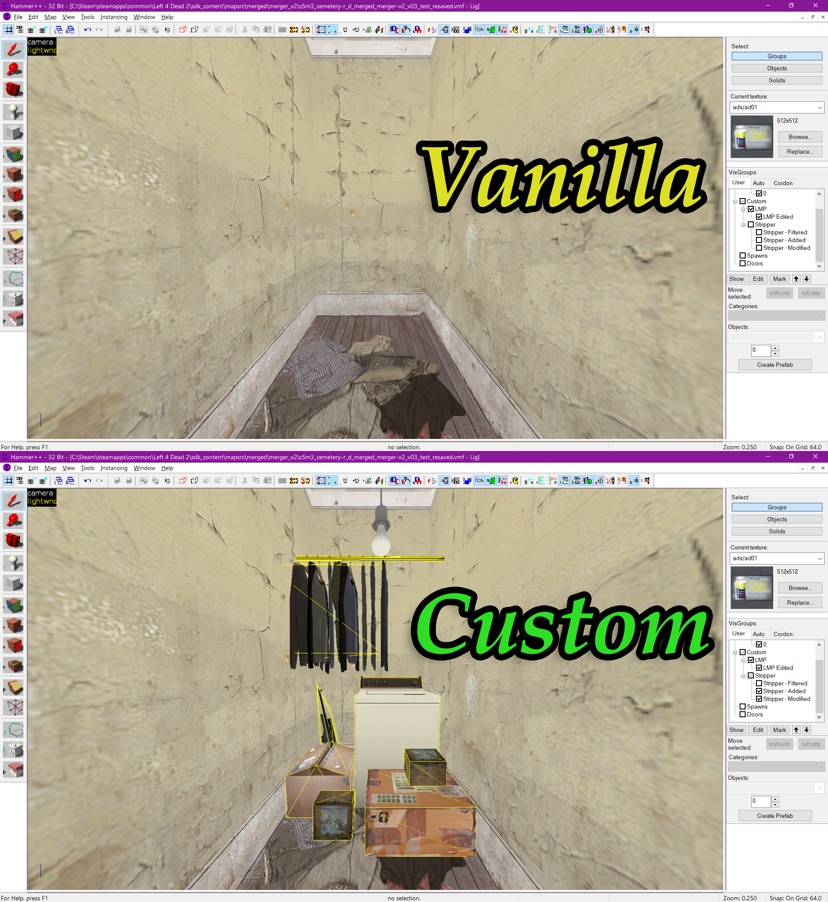
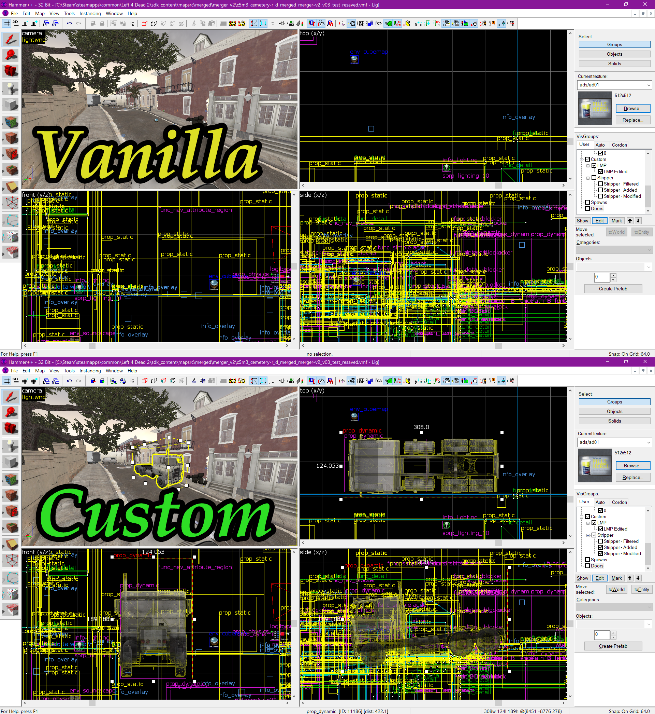

# Valve Source Tools

## Introduction

**Valve Source Tools** is a set of console instruments designed to work with Valve's software infrastructure, including Steam and Source Engine games.

Currently the core of its functionality lies in two **PowerShell** modules: `ValveSourceTools.Steam` and `ValveSourceTools.SourceEngine`. These modules are designed to work with **Windows PowerShell** (version 5.1) and **.NET Framework 4.8+**.\
Note that even though Windows PowerShell is shipped with every standard Windows installation, it is recommended to use a more recent version of PowerShell, which is available as a separate downloadable distributive. Refer to the [Links](#powershell) section for the latest version of PowerShell.

## Description

`ValveSourceTools.Steam` provides parsers for `.ini` and Valve's `.vdf` formats. VDFs are used by Steam to store configurations and other related information. This module is currently in development with more features coming later, as well as user-oriented instruments built on top of them.

`ValveSourceTools.SourceEngine` is designed to work with Source Engine resources and provides multiple instruments for importing/exporting `.vmf`, `.lmp` and Stripper's `.cfg` formats, as well as merging them together.

See the [Links](#links) section for more info.

## ValveSourceTools.SourceEngine — What does it do?

Source Engine maps are packed in the `.bsp` format (see [BSP (Source)](https://developer.valvesoftware.com/wiki/BSP_(Source))). It's a map compiled for the game engine, but it's not the format you can work with in a [map editor](#map-editors) (Hammer or Hammer++). To work on a map you need to [decompile](#bsp-decompilers) it, which gives you a `.vmf` file. Its structure is similar to JSON, except it allows for the same key to have numerous different values (so not the usual unique key-value pair). 

If a map is updated after the game was already shipped, devs don't change the whole `.bsp` file. Instead, they add additional files (`.lmp`, [LUMP](https://developer.valvesoftware.com/wiki/Lump_file_format)) that describe changes to the map. These files are read and processed by the game engine when the map is loaded.

Additionally, server admins may also want to introduce unique changes to the maps on their own servers. A common way to do that would be with the help of a **Metamod** plugin, [**Stripper:Source**](#stripper). It allows you to *add*, *remove* or *modify* entities on the map without requiring clients to have the same version of the map, because all of the `.bsp` and `.lmp` files remain unchanged. All the changes are described in `.cfg` files with specific instructions for **Metamod** that are executed on map launch.

However, there is no known way to work with those Stripper's config files locally in a map editor, no way to incorporate all the changes. That is, there wasn't until now...

There can be three (or more) different files with slightly different formats that describe the end result seen by players on the server. In order to load it all in the map editor, the `ValveSourceTools.SourceEngine` module was developed that would help merge these resources into a new single `.vmf` file.

- [Simple usage examples](docs/examples/simple.md)
- [Advanced usage examples](docs/examples/advanced.md)

<details open>

<summary>So how does it look like?</summary>

### Showcase

**Vanilla** is how it looks like in the base game.\
**Custom** is an example of how it may look like on a community server.\
Now you can have these changes in the map editor, too.




</details>

### Notes

- Even though this module is supposed to work with a number of Source games, it was only thoroughly tested with **Left 4 Dead 2**.
- Use `Get-Help <function name> -Full` to get complete help info on a given function.
- All of the module's public functions accept both absolute and relative paths as inputs.
- Specify path to a log file with the `-LogFile` parameter for any function to log its actions.
- Include the `-Silent` paramater to suppress both console and file logging *even* if path to a log file was specified. Note that progress bars will still be visible, as the whole process may take some time (usually takes a few seconds, but can be half a minute, depending on your machine and main core load at the moment). Those will be wiped from the screen after the process is done.

## Getting started

### No Installation Option

You don't need to install the modules in order to use them — just downloading them is enough:
1. Click on the `<> Code` button in the top-right corner of this page, choose **"Download ZIP"** and save it anywhere you want;
2. Unpack the zip to a directory of your choosing;
	- Make sure to avoid whitespaces in the path.
3. Launch PowerShell CLI in the directory where the zip was unpacked to;
4. Import the modules:

```powershell
Import-Module .\ValveSourceTools.SourceEngine\ValveSourceTools.SourceEngine.psd1
Import-Module .\ValveSourceTools.Steam\ValveSourceTools.Steam.psd1
```

Now these modules will be loaded for the duration of the session.

### Installation

Install the modules on your system:
1. Click on the `<> Code` button in the top-right corner of this page, choose **"Download ZIP"** and save it anywhere you want;
2. Unpack the zip to a directory of your choosing;
	- Make sure to avoid whitespaces in the path.
3. Launch PowerShell CLI in the directory where the zip was unpacked to;
4. Run `.\setup.bat`

Now these modules will be available whenever you launch PowerShell.

### Getting help

These commands will help you get started:
```powershell
Get-Module ValveSourceTools.* -ListAvailable

Get-Help ValveSourceTools.SourceEngine
Get-Help ValveSourceTools.Steam
Get-Help <FunctionName> -Full
```
Where `<FunctionName>` is a name of a function, e.g. `Get-Help Merge-Map -Full`

List of available function names (`ValveSourceTools.SourceEngine`): `Import-Vmf`, `Export-Vmf`, `Import-Lmp`, `Export-Lmp`, `Import-Stripper`, `Export-Stripper`, `Merge-Map`

List of available function names (`ValveSourceTools.Steam`): `Import-Vdf`, `Export-Vdf`, `Import-Ini`, `Export-Ini`

## Links
#### Source Engine
- [BSP (Source) | Valve Developer Community](https://developer.valvesoftware.com/wiki/BSP_\(Source\))
- [Binary Space Partitioning | Valve Developer Community](https://developer.valvesoftware.com/wiki/Binary_space_partitioning)
- [VMF (Valve Map Format) | Valve Developer Community](https://developer.valvesoftware.com/wiki/VMF_\(Valve_Map_Format\))
- [Lump file format | Valve Developer Community](https://developer.valvesoftware.com/wiki/Lump_file_format)

#### Stripper
- [Stripper:Source | AlliedModders](https://forums.alliedmods.net/showthread.php?t=39439)
- [Stripper:Source | bailopan](https://www.bailopan.net/stripper/)
- [alliedmodders/stripper-source | GitHub](https://github.com/alliedmodders/stripper-source/tree/master)

#### BSP Decompilers
- [List of the Source decompilers | Valve Developer Community](https://developer.valvesoftware.com/wiki/Decompiling_Maps#Source)
- [BSPSource | Valve Developer Community](https://developer.valvesoftware.com/wiki/BSPSource)
- [BSPSource Releases | GitHub](https://github.com/ata4/bspsrc/releases)
- [List of decompiled maps by Spumer | GitHub](https://github.com/spumer/left_4_dead_2__decompiled_maps/)

#### Map Editors
- [Valve Hammer Editor (Source) | Valve Developer Community](https://developer.valvesoftware.com/wiki/Valve_Hammer_Editor)
- [Hammer++ | Valve Developer Community](https://developer.valvesoftware.com/wiki/Hammer%2B%2B)
- [Hammer++ Features | ficool2.github.io](https://ficool2.github.io/HammerPlusPlus-Website/features.html)

#### PowerShell
- [PowerShell/PowerShell | GitHub](https://github.com/PowerShell/PowerShell/tree/master)
	- See **Releases** for the latest version;
	- Or use [winget](https://learn.microsoft.com/en-us/windows/package-manager/winget/): `winget install Microsoft.PowerShell`